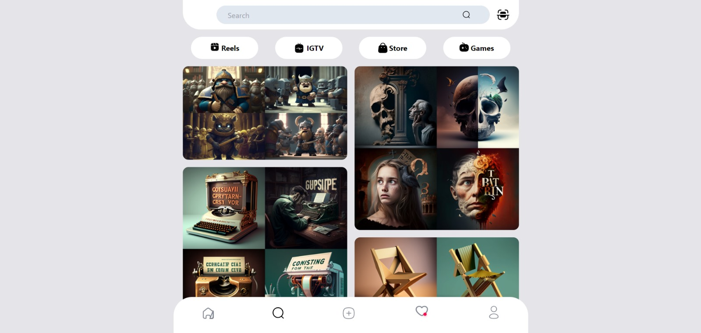

<h2>INSTAGRAM CLONE</h2>

This project is a simple instagram clone that only covers explore posts, search, profile and likes screens.

<h2>USAGE</h2>

1. Fork the repo and then clone it or download it.

2.First install all dependencies:

  <storng>npm install</storng> (with npm)  
  <storng>yarn</storng> (or with yarn)

  

3. Start the server

npm start [OR] yarn start

  

4. Now run the app

localhost:[PORT]

  

<h3>Responsive</h3>

 

